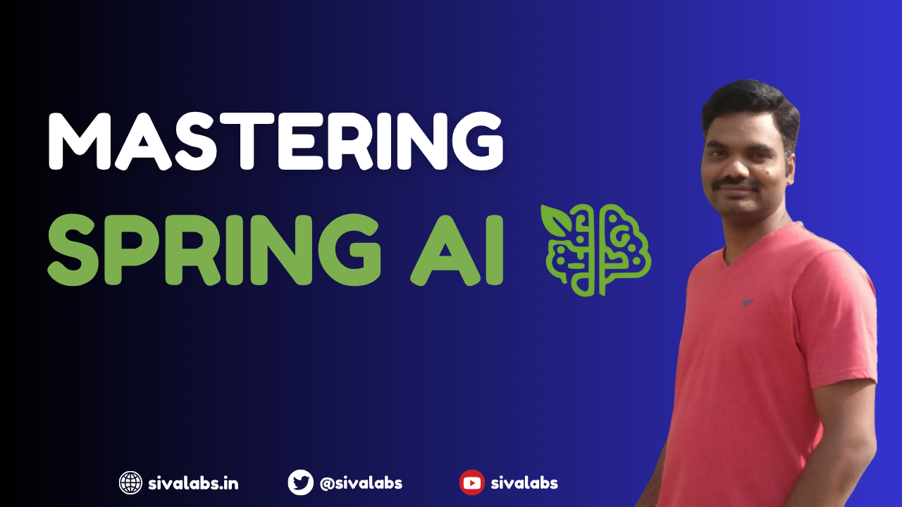

# Mastering Spring AI Course
This is a complete course to master [Spring AI](https://spring.io/projects/spring-ai) by [SivaLabs](https://www.youtube.com/sivalabs).

## Table of Contents
1. [Getting Started with Spring AI and OpenAI](https://youtu.be/djb3KRV-cno)
2. [Chat with OpenAI Compatible Models (Gemini, Groq, Docker Model Runner, etc.)](https://youtu.be/efRd68orIqY)
3. [Chat with Ollama](https://youtu.be/HLiZfHuiwsQ)
4. [Chat with Anthropic Models](https://youtu.be/v_MmSCsdnpo)
5. [Prompt Templates](https://youtu.be/cGEBrJlpvyk)
6. [Structured Output](https://youtu.be/MpTNOhJ_Jjk)
7. [Chat Memory](https://youtu.be/LTkch_PO2mM)
8. [Embedding Models & Vector Stores and RAG](https://youtu.be/uUmdAa5OF9k)
9. Tool Calling
10. Model Context Protocol (MCP)

